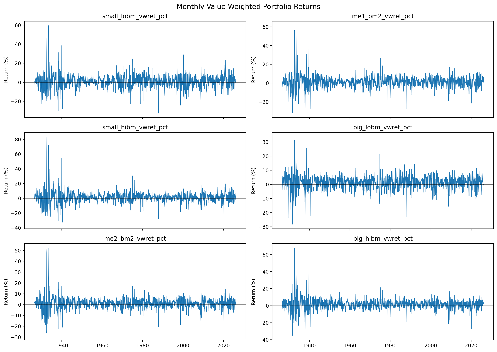
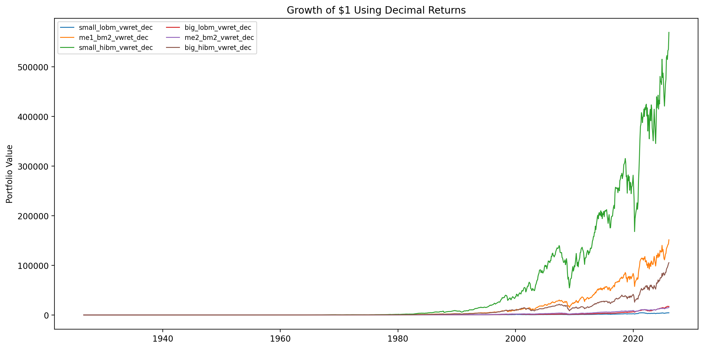
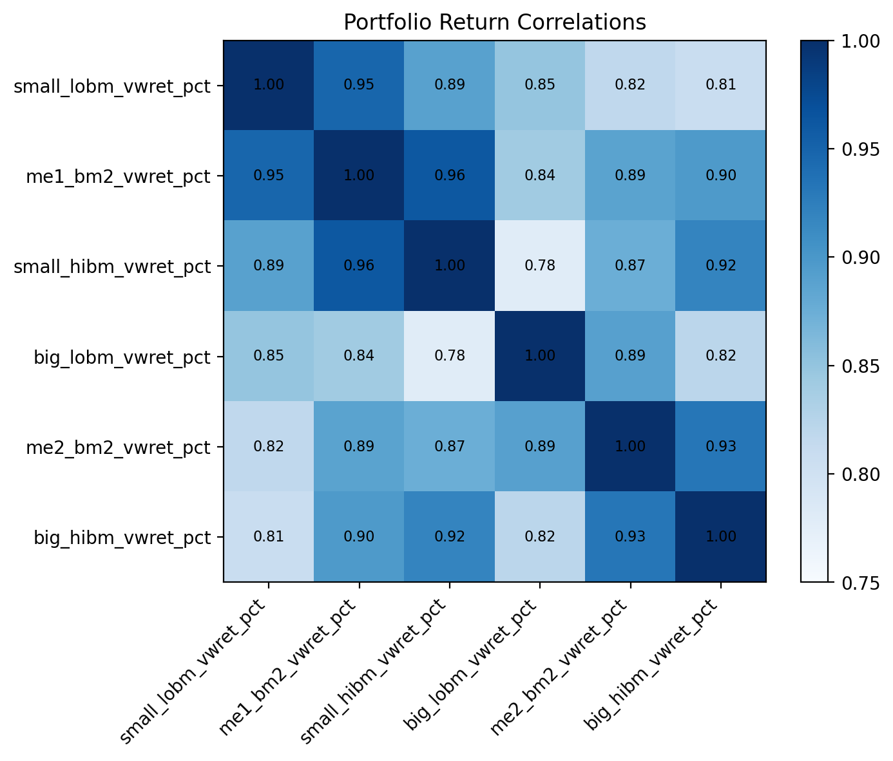
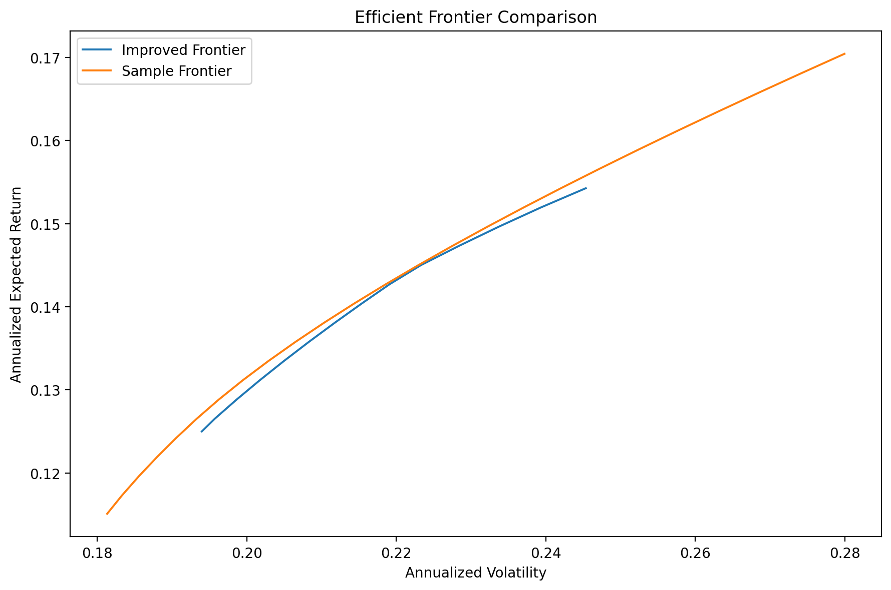
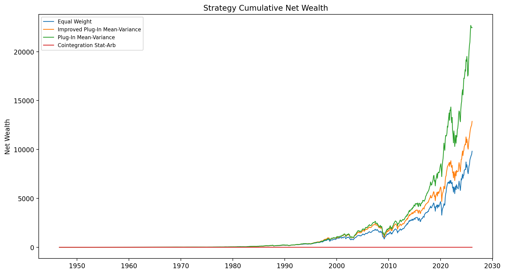

# Final Report

## Modeling and Trading Strategies for Six Kenneth French Portfolios

FMA4200 Final Project  
Prepared from the reproducible pipeline in `Final Project/` on 2026-04-12.

## 1. Introduction

This project studies the monthly returns of six value-weighted portfolios sorted on size and book-to-market, using the century-long Kenneth French sample provided for the course. These portfolios are a useful laboratory because they compress two core asset-pricing dimensions into a small panel that is still rich enough for univariate modeling, multivariate dependence analysis, and portfolio construction. The assignment is therefore not only about describing returns; it is about connecting descriptive evidence to forecasting, relative-value trading, and mean-variance allocation decisions.

The research background combines empirical asset pricing with time-series econometrics. Markowitz (1952) provides the benchmark portfolio-choice framework, while Fama and French (1993) show why size and value portfolios are economically meaningful objects rather than arbitrary return series. On the econometric side, Hamilton (1994) motivates ARIMA-class mean models; Engle (1982) and Bollerslev (1986) explain why volatility clustering can remain highly predictable even when the conditional mean is weak. For multivariate trading, Engle and Granger (1987) and Gatev, Goetzmann, and Rouwenhorst (2006) motivate looking for long-run relations and mean-reverting spreads. For implementation, Jagannathan and Ma (2003), Ledoit and Wolf (2004), and DeMiguel, Garlappi, and Uppal (2009) caution that unconstrained plug-in optimization can look stronger in sample than out of sample.

That literature implies five questions for the current dataset. First, are the six monthly return series close to Gaussian, or do they show the heavy tails and volatility clustering familiar from financial data? Second, do low-order ARIMA models capture the conditional mean adequately, or is residual structure left over? Third, can lagged exogenous predictors such as Fama-French factors and internally constructed spread signals improve forecasting? Fourth, do the six portfolios contain enough long-run common structure to support cointegration-based statistical arbitrage once a nonstationary representation is used? Fifth, how do equal-weight, textbook mean-variance, and improved shrinkage-based allocation rules compare after transaction costs?

The report's main contribution is to answer those questions within one reproducible workflow. The evidence ultimately favors a balanced conclusion rather than a single triumphant model. The data show strong common movement, clear non-normality, and persistent conditional volatility. Predictive gains in the conditional mean are present but modest, cointegration is statistically meaningful only on wealth indices and not consistently stable through time, and the most robust practical results come from rolling portfolio allocation rather than from statistical arbitrage.

## 2. Data Source and Processing

The raw input is the course-provided [Data.csv](../Data.csv), which matches the Kenneth French six-portfolio file formed on size and book-to-market using the 202601 CRSP database. The local raw file contains descriptive text above the monthly return block and footer text below it, so the cleaning stage programmatically locates the true header row before parsing the monthly value-weighted panel. Sentinel values `-99.99` and `-999` are converted to missing values during import rather than treated as genuine returns.

The return-unit convention is explicit because the Kenneth French data are reported in percent units. A raw value of `1.0866` therefore means a return of `1.0866%`, not `1.0866` in decimal form. The canonical cleaned file keeps the six portfolio series in percent units with `_pct` suffixes, while a companion decimal file divides each return by `100.0` for steps that require decimal arithmetic.

**Table 1. Cleaned variables and units.**

| Variable | Definition | Unit |
| --- | --- | --- |
| date | Month-end date derived from the raw YYYYMM code | date |
| small_lobm_vwret_pct | Small size, low book-to-market portfolio return | percent |
| me1_bm2_vwret_pct | Small size, middle book-to-market portfolio return | percent |
| small_hibm_vwret_pct | Small size, high book-to-market portfolio return | percent |
| big_lobm_vwret_pct | Big size, low book-to-market portfolio return | percent |
| me2_bm2_vwret_pct | Big size, middle book-to-market portfolio return | percent |
| big_hibm_vwret_pct | Big size, high book-to-market portfolio return | percent |

The cleaned sample spans July 1926 through January 2026 and contains 1,195 monthly observations with no duplicate dates and no missing values after sentinel conversion. Figure 1 shows that all six return series move with the broad U.S. equity market but differ in amplitude across crises and recoveries. Figure 2 translates those return differences into long-run wealth paths, where the small-value portfolio ultimately earns the strongest growth path but with visibly larger drawdowns. Figure 3 reinforces the same point in cross-sectional form: the portfolios are highly correlated, yet not so collinear that diversification and multivariate modeling become meaningless.

*Figure 1. Monthly portfolio returns from July 1926 to January 2026.*

*Figure 2. Growth of $1 invested in each portfolio using monthly decimal returns.*

*Figure 3. Cross-portfolio correlation heatmap for the six monthly return series.*

**Table 2. Portfolio summary statistics in percent units.**

| Portfolio | Mean (%) | Annualized mean (%) | Volatility (%) | Annualized volatility (%) |
| --- | --- | --- | --- | --- |
| Small LoBM | 0.97 | 11.69 | 7.43 | 25.75 |
| ME1 BM2 | 1.24 | 14.83 | 6.94 | 24.05 |
| Small HiBM | 1.42 | 17.04 | 8.08 | 27.99 |
| Big LoBM | 0.96 | 11.50 | 5.27 | 18.24 |
| ME2 BM2 | 0.96 | 11.55 | 5.60 | 19.40 |
| Big HiBM | 1.21 | 14.55 | 7.08 | 24.53 |

Table 2 shows two patterns that drive the rest of the report. The highest average return belongs to Small HiBM at 1.42% per month, but it is also the most volatile at 8.08% per month. At the other end, Big LoBM is much less volatile at 5.27% per month. The pairwise correlation range, from about 0.778 to 0.961, is high enough to motivate joint modeling and efficient-frontier analysis while still leaving room for relative-value spreads and diversification.

## 3. Modeling the Individual Portfolio Returns

### 3.1 Distributional Properties and Stationarity

Each portfolio was analyzed with time-series plots, histogram-density plots that overlay fitted Gaussian and Student-t densities, two-panel QQ plots, ACF/PACF, Jarque-Bera tests, Shapiro-Wilk tests, fitted-distribution comparisons, ADF and KPSS tests, Ljung-Box diagnostics, and ARCH-LM tests. Detailed figures are kept in the appendix and the `output/figures/individual_returns/` folders so the main body can focus on the highest-signal results. The central finding is that the six series are stationary in levels but far from Gaussian, with visible tail risk and volatility clustering even at the monthly frequency.

**Table 3. Distribution, normality, stationarity, and ARCH diagnostics.**

| Portfolio | Skewness | Excess kurtosis | Jarque-Bera p | Shapiro-Wilk p | Best fit | Student-t df | ADF p | ARCH-LM p |
| --- | --- | --- | --- | --- | --- | --- | --- | --- |
| Small LoBM | 0.57 | 6.92 | <0.001 | <0.001 | Student-t | 3.99 | <0.001 | <0.001 |
| ME1 BM2 | 1.10 | 13.41 | <0.001 | <0.001 | Student-t | 3.26 | <0.001 | <0.001 |
| Small HiBM | 1.96 | 20.85 | <0.001 | <0.001 | Student-t | 2.81 | <0.001 | <0.001 |
| Big LoBM | -0.13 | 5.20 | <0.001 | <0.001 | Student-t | 4.29 | <0.001 | <0.001 |
| ME2 BM2 | 1.16 | 17.20 | <0.001 | <0.001 | Student-t | 3.14 | <0.001 | <0.001 |
| Big HiBM | 1.44 | 17.45 | <0.001 | <0.001 | Student-t | 3.08 | <0.001 | <0.001 |

Table 3 makes the distributional result hard to miss. Jarque-Bera and Shapiro-Wilk p-values are effectively zero across the panel, and the fitted Student-t distribution dominates the fitted Gaussian benchmark in 6 of the 6 portfolios. The most extreme non-normality appears in Small HiBM, where the Student-t fit gains the most ground on AIC and the excess-kurtosis evidence is especially strong. At the same time, ADF p-values strongly reject a unit root for every raw return series, which justifies modeling returns in levels rather than differencing them. ARCH-LM tests also reject homoskedasticity throughout the panel, with the strongest raw-volatility clustering in ME2 BM2.

### 3.2 ARIMA Benchmarks and GARCH-Type Volatility Models

Given the stationarity evidence, the mean-model search compared low-order AR, MA, and ARIMA specifications using AIC, BIC, residual Ljung-Box tests, and parameter significance. The volatility step now uses the canonical `arch` package rather than a custom optimizer. For each portfolio, the selected ARIMA residuals were passed to Gaussian and Student-t GARCH(1,1) specifications, and the preferred volatility model was selected using AIC, BIC, standardized-residual diagnostics, and core-parameter significance.

**Table 4. Selected benchmark mean and volatility models.**

| Portfolio | Selected ARIMA | Selected volatility | Innovation dist. | Residual Ljung-Box p (12) | GARCH persistence | Std. sq. resid. LB p (12) | Std. resid. ARCH-LM p |
| --- | --- | --- | --- | --- | --- | --- | --- |
| Small LoBM | (0, 0, 2) | Student-t GARCH(1,1) | Student-t | 0.314 | 0.979 | 0.958 | 0.958 |
| ME1 BM2 | (2, 0, 2) | Student-t GARCH(1,1) | Student-t | 0.005 | 0.970 | 0.863 | 0.872 |
| Small HiBM | (2, 0, 2) | Student-t GARCH(1,1) | Student-t | 0.002 | 0.978 | 0.968 | 0.968 |
| Big LoBM | (2, 0, 2) | Student-t GARCH(1,1) | Student-t | 0.977 | 0.967 | 0.628 | 0.632 |
| ME2 BM2 | (2, 0, 2) | Student-t GARCH(1,1) | Student-t | 0.057 | 0.962 | 0.378 | 0.428 |
| Big HiBM | (2, 0, 2) | Student-t GARCH(1,1) | Student-t | 0.067 | 0.962 | 0.611 | 0.670 |

The mean dynamics are modest. Five of the six portfolios select ARIMA(2,0,2), while Small LoBM selects ARIMA(0,0,2). Residual diagnostics are acceptable for the larger, lower-volatility portfolios but remain weaker for ME1 BM2 and Small HiBM, which is why the report does not overstate the quality of purely univariate mean models. The variance dynamics are more striking. GARCH persistence remains high across the six series, and the selected arch-based volatility filters largely remove the leftover second-moment dependence. The Student-t volatility specification is selected in 6 of the 6 portfolios, which matches the heavy-tail evidence already visible in the marginal distribution diagnostics. That pattern aligns with the finance literature: monthly returns are hard to forecast in mean, but their volatility remains persistent and often better captured with non-Gaussian innovations.

### 3.3 Predictive Models with Exogenous Variables

The predictive extension combines lagged authoritative Fama-French factors with internally constructed signals such as lagged size and value spreads, 12-month rolling market volatility, 12-month momentum, and drawdown-style indicators. Three classes are compared portfolio by portfolio: the selected benchmark ARIMA model, an ARIMAX specification with lagged factors, and a predictive regression with lagged returns plus the broader predictor set. Performance is evaluated both in sample and with a 120-month expanding one-step-ahead forecast exercise using RMSE, MAE, and directional accuracy.

**Table 5. Best predictive model versus the univariate benchmark.**

| Portfolio | Preferred model | Benchmark RMSE | Predictive RMSE | RMSE gain vs. benchmark (%) | Directional accuracy |
| --- | --- | --- | --- | --- | --- |
| Small LoBM | Predictive regression | 6.652 | 6.734 | -1.22 | 0.533 |
| ME1 BM2 | Predictive regression | 6.167 | 6.238 | -1.15 | 0.583 |
| Small HiBM | Predictive regression | 6.852 | 6.906 | -0.80 | 0.550 |
| Big LoBM | ARIMAX | 4.700 | 4.733 | -0.70 | 0.650 |
| ME2 BM2 | ARIMAX | 4.807 | 4.668 | 2.90 | 0.592 |
| Big HiBM | Predictive regression | 6.457 | 6.134 | 5.00 | 0.625 |

The out-of-sample gains are real but limited. Only 2 of the 6 portfolios improve on the benchmark RMSE, and the strongest gain belongs to Big HiBM, where the preferred predictive regression improves RMSE by 5.00% relative to the benchmark. This is an economically sensible result rather than a disappointment. Monthly portfolio returns should not be expected to yield large and stable conditional-mean predictability, and the evidence here agrees with that view: exogenous signals help selectively, but they do not overturn the basic conclusion that volatility structure is more reliable than mean structure.

## 4. Trading Strategies

### 4.1 Joint Multivariate Dynamics and Cointegration Logic

The multivariate stage begins with a VAR fitted to the six return series. Lag lengths from 1 to 12 were compared with standard information criteria, and the BIC-selected benchmark is VAR(1). Stability holds because all inverse roots remain outside the unit circle, but the residual diagnostics remain imperfect: the whiteness and multivariate normality tests are both decisively rejected. Those rejections are consistent with the heavy tails and volatility clustering already documented in the univariate analysis, so they weaken any claim of fully adequate Gaussian linear dynamics without invalidating the VAR as a descriptive benchmark.

Cointegration requires a nonstationary representation, so it would be incorrect to apply Johansen tests mechanically to raw returns. The report instead tests integration order first, then moves to cumulative log wealth. The raw returns are stationary for all six portfolios, while the log-wealth levels are nonstationary and their first differences are stationary. That is exactly the environment in which Johansen analysis becomes conceptually defensible.

**Table 6. Joint dynamics and cointegration diagnostics.**

| Metric | Result |
| --- | --- |
| Selected VAR lag (BIC) | 1 |
| VAR stability | Stable |
| Whiteness test p-value | <0.001 |
| Normality test p-value | <0.001 |
| Raw returns classified stationary | 100.0% |
| Log wealth classified nonstationary | 100.0% |
| Diff. log wealth classified stationary | 100.0% |
| Johansen trace statistic (rank 0) | 101.303 |
| Johansen 5% critical value | 95.754 |
| Selected cointegration rank | 1 |

The full-sample Johansen trace test selects rank 1, which suggests one long-run equilibrium relation among the six wealth indices. That result is statistically interesting, but the economic interpretation must remain cautious. In the rolling estimation windows used for trading, positive cointegration rank appears in only 38.4% of the monthly windows, so the long-run relation is episodic rather than permanently stable.

### 4.2 Statistical Arbitrage Backtest

The statistical-arbitrage strategy uses a 240-month rolling estimation window and refits the first cointegration relation every 12 months. It trades the standardized spread when the z-score exits a +/-1.5 band and closes positions once the z-score returns inside +/-0.5. Turnover is tracked directly, and transaction costs are set to 10 basis points per one-way turnover unit. This design avoids look-ahead bias because signals and weights at month t are built only from information available through month t-1.

The performance is weak after costs. The strategy earns -0.11% annualized net return with annualized net volatility of 1.42%, a net Sharpe of -0.077, and a max drawdown of -18.83%. The negative result is important because it shows that a statistically significant full-sample cointegration relation is not enough on its own to support a robust trading rule once parameter instability and transaction costs are taken seriously.

### 4.3 Mean-Variance Allocation and Improved Plug-In Strategy

The portfolio-allocation comparison is stronger than the stat-arb exercise. The report first traces the efficient frontier using rolling sample moments, then backtests three implementable strategies over the common out-of-sample period: equal weight, a sample plug-in mean-variance strategy with full investment and no short sales, and an improved plug-in strategy that replaces the sample covariance matrix with Ledoit-Wolf shrinkage and adds weight bounds plus a turnover penalty.

*Figure 4. Efficient frontier from sample mean and covariance estimates.*

*Figure 5. Cumulative net wealth for the trading strategies over the common out-of-sample window.*

**Table 7. Out-of-sample strategy comparison after transaction costs.**

| Strategy | Annualized net return (%) | Annualized net volatility (%) | Net Sharpe | Max drawdown (%) | Average monthly turnover |
| --- | --- | --- | --- | --- | --- |
| Plug-In Mean-Variance | 13.42 | 15.36 | 0.873 | -55.65 | 0.0438 |
| Improved Plug-In Mean-Variance | 12.63 | 15.49 | 0.815 | -58.11 | 0.0034 |
| Equal Weight | 12.24 | 16.48 | 0.743 | -53.93 | 0.0076 |
| Cointegration Stat-Arb | -0.11 | 1.42 | -0.077 | -18.83 | 0.0222 |

Figure 4 shows that the return-covariance structure does allow higher expected-return portfolios along the frontier, but Figure 5 makes the implementation lesson clearer: the allocation strategies dominate the cointegration strategy over the realized sample. Table 7 shows that the plug-in mean-variance strategy achieves the highest net Sharpe at 0.873, outperforming equal weight on both return and risk-adjusted performance. The improved shrinkage strategy does not quite match the plug-in Sharpe, but it remains competitive while cutting average turnover from 0.0438 to 0.0034. That tradeoff is economically attractive because the lower-turnover strategy is much closer to what a practical allocator would want to implement repeatedly.

## 5. Conclusions

This project turns a century of monthly Kenneth French portfolio returns into an integrated modeling and strategy exercise. The descriptive results show economically meaningful differences across the six portfolios, especially the higher mean and higher volatility of the small-value portfolio. The univariate modeling stage shows that monthly returns are stationary in levels but strongly non-normal, with pronounced tail behavior and persistent volatility. Low-order ARIMA models remain useful mean benchmarks, yet the stronger regularity in the data lies in second moments rather than in large and stable mean dynamics.

Adding exogenous predictors improves the forecasting design more than it improves accuracy. The preferred predictive specifications beat the univariate benchmark RMSE in only 2 of the 6 portfolios, with the best gain coming from Big HiBM. That result is still useful because it aligns with the literature: predictable variation in monthly returns exists, but it is modest and difficult to exploit consistently once the benchmark already captures low-order mean dynamics.

The trading analysis yields an intentionally mixed set of conclusions. The VAR(1) is stable and confirms strong joint dependence, but the residual diagnostics still reject whiteness and normality. Cointegration is meaningful only after moving from stationary returns to nonstationary log-wealth indices, and even then the statistical-arbitrage evidence is weak out of sample. The cointegration strategy delivers -0.11% annualized net return with a net Sharpe of -0.077 after transaction costs, so the report treats it as an honest negative result rather than forcing a profitable narrative.

The strongest practical result comes from portfolio allocation. Relative to equal weight, the sample plug-in mean-variance strategy earns a higher net Sharpe (0.873 versus 0.743), but the improved shrinkage-and-controls variant is the more implementable design because it preserves a competitive net Sharpe of 0.815 while reducing average turnover by about 12.8x. The main contribution of the project is therefore not a single dominant forecasting model or arbitrage rule, but a transparent end-to-end comparison showing which textbook ideas remain useful after diagnostics, out-of-sample testing, and transaction costs are taken seriously.

## References

## Data Source

1. Kenneth R. French Data Library. "Data Library Home Page." Tuck School of Business at Dartmouth. Accessed April 11, 2026. https://mba.tuck.dartmouth.edu/pages/faculty/ken.french/data_library.html

## Academic References

2. Bollerslev, Tim. 1986. "Generalized Autoregressive Conditional Heteroskedasticity." *Journal of Econometrics* 31 (3): 307-327. https://doi.org/10.1016/0304-4076(86)90063-1

3. Campbell, John Y., and Robert J. Shiller. 1988. "The Dividend-Price Ratio and Expectations of Future Dividends and Discount Factors." *The Review of Financial Studies* 1 (3): 195-228.

4. DeMiguel, Victor, Lorenzo Garlappi, and Raman Uppal. 2009. "Optimal Versus Naive Diversification: How Inefficient Is the 1/N Portfolio Strategy?" *The Review of Financial Studies* 22 (5): 1915-1953. https://doi.org/10.1093/rfs/hhm075

5. Engle, Robert F. 1982. "Autoregressive Conditional Heteroscedasticity with Estimates of the Variance of United Kingdom Inflation." *Econometrica* 50 (4): 987-1008. https://doi.org/10.2307/1912773

6. Engle, Robert F., and Clive W. J. Granger. 1987. "Co-Integration and Error Correction: Representation, Estimation, and Testing." *Econometrica* 55 (2): 251-276. https://doi.org/10.2307/1913236

7. Fama, Eugene F., and Kenneth R. French. 1988. "Dividend Yields and Expected Stock Returns." *Journal of Financial Economics* 22 (1): 3-25. https://doi.org/10.1016/0304-405X(88)90020-7

8. Fama, Eugene F., and Kenneth R. French. 1993. "Common Risk Factors in the Returns on Stocks and Bonds." *Journal of Financial Economics* 33 (1): 3-56. https://doi.org/10.1016/0304-405X(93)90023-5

9. Gatev, Evan, William N. Goetzmann, and K. Geert Rouwenhorst. 2006. "Pairs Trading: Performance of a Relative-Value Arbitrage Rule." *The Review of Financial Studies* 19 (3): 797-827. https://doi.org/10.1093/rfs/hhj020

10. Hamilton, James D. 1994. *Time Series Analysis*. Princeton, NJ: Princeton University Press.

11. Jagannathan, Ravi, and Tongshu Ma. 2003. "Risk Reduction in Large Portfolios: Why Imposing the Wrong Constraints Helps." *The Journal of Finance* 58 (4): 1651-1684. https://doi.org/10.1111/1540-6261.00580

12. Ledoit, Olivier, and Michael Wolf. 2004. "A Well-Conditioned Estimator for Large-Dimensional Covariance Matrices." *Journal of Multivariate Analysis* 88 (2): 365-411. https://doi.org/10.1016/S0047-259X(03)00096-4

13. Markowitz, Harry. 1952. "Portfolio Selection." *The Journal of Finance* 7 (1): 77-91. https://doi.org/10.1111/j.1540-6261.1952.tb01525.x
